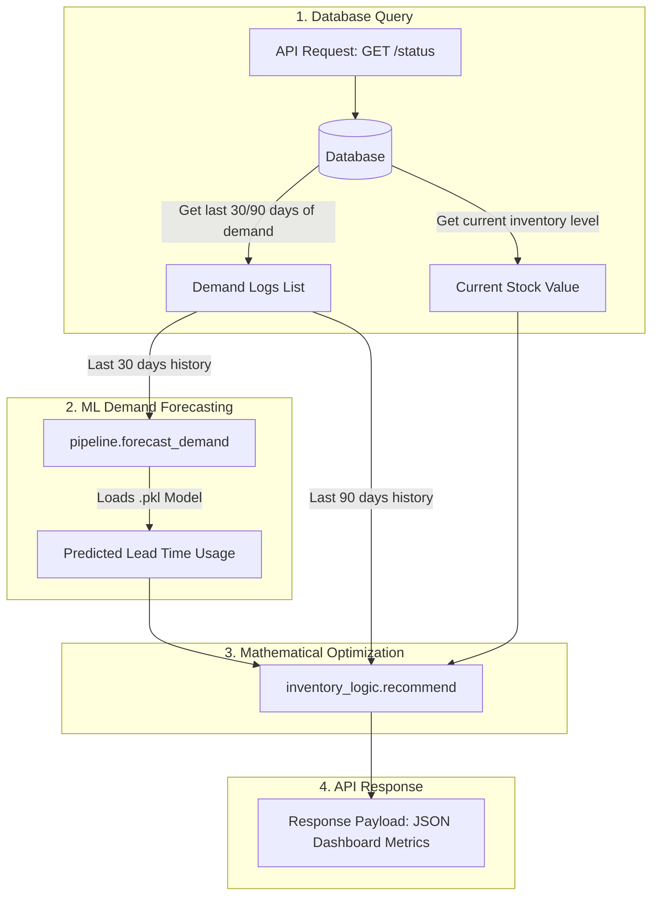

# Inventory Optimization Engine: Backend Integration Guide

This guide details the directory structure, file locations, function maps, and integration workflows for the backend team.

---

## 📁 Directory Structure & Function Map

Below is the directory map of the project showing the exact module files and the functions they contain.

| File Path | Function Name | Purpose | When to Call |
| :--- | :--- | :--- | :--- |
| [inventory_logic.py](file:///home/shaikafnan/cs756/inventory_logic.py) | `recommend()` | Calculates safety stock, ROP, EOQ, and stockout risk alert. | Every time the inventory dashboard page loads or refreshes. |
| [pipeline.py](file:///home/shaikafnan/cs756/pipeline.py) | `forecast_demand()` | Generates a multi-step future demand projection using GBDT models. | To predict lead-time usage (pre-requisite for `recommend()`). |
| [pipeline.py](file:///home/shaikafnan/cs756/pipeline.py) | `simulate_shortage()` | Adjusts stock levels to 10% to test stockout alerts. | During demo/testing to trigger "HIGH" risk states. |
| [baseline_model.py](file:///home/shaikafnan/cs756/baseline_model.py) | `train_baseline_models()` | Re-trains models on fresh transaction logs. | Periodic cron/background task (e.g. weekly or monthly). |
| [generate_data.py](file:///home/shaikafnan/cs756/generate_data.py) | `generate_synthetic_data()` | Creates dummy historical logs for ERP database seeding. | Initial project setup / testing environment configuration. |

---

## 🔄 Backend Integration Workflow

During live app operation, the data flows between your database (SQL/NoSQL), the forecasting model, the mathematical optimizer, and finally to your API controller.



---

## 🛠️ Code Specifications & API Schemas

### 1. Demand Forecaster
* **File Location:** [pipeline.py](file:///home/shaikafnan/cs756/pipeline.py)
* **Function Signature:**
  ```python
  def forecast_demand(
      material_id: str, 
      historical_usage_30: list[float], 
      lead_time_days: int, 
      models_dir: str = "models", 
      reference_date: datetime = None
  ) -> list[float]
  ```
* **Integration Guidelines:** Query your transactional database to fetch the last 30 daily usage integers for `historical_usage_30` to seed this function.

---

### 2. Inventory Optimization Calculator
* **File Location:** [inventory_logic.py](file:///home/shaikafnan/cs756/inventory_logic.py)
* **Function Signature:**
  ```python
  def recommend(
      material_id: str,
      current_stock: float,
      forecasted_usage: list[float],
      lead_time_days: int,
      historical_usage_90: list[float],
      order_cost: float = 50.0,
      holding_cost_per_unit: float = 2.0
  ) -> dict
  ```
* **Integration Guidelines:** Send the output of `forecast_demand` as `forecasted_usage`, along with the last 90 daily usage records as `historical_usage_90`.

---

## ⚡ Mock FastAPI Controller Implementation

Below is a complete implementation showing how your backend team can wrap these functions in a FastAPI endpoint.

```python
from fastapi import FastAPI, HTTPException
from pydantic import BaseModel
from datetime import datetime
import os

# Import the helpers directly from your workspace
from pipeline import forecast_demand
from inventory_logic import recommend

app = FastAPI(title="Inventory Optimization & Material Planning System")

class OptimizationRequest(BaseModel):
    material_id: str
    current_stock: float
    lead_time_days: int
    historical_usage_90: list[float]  # Last 90 days of daily consumption
    order_cost: float = 50.0
    holding_cost_per_unit: float = 2.0

class OptimizationResponse(BaseModel):
    material_id: str
    current_stock: int
    safety_stock: int
    reorder_point: int
    eoq: int
    recommended_order_qty: int
    stockout_risk: str
    forecasted_usage: list[float]

@app.post("/api/inventory/optimize", response_model=OptimizationResponse)
def get_inventory_recommendation(payload: OptimizationRequest):
    if len(payload.historical_usage_90) < 90:
        raise HTTPException(
            status_code=400, 
            detail="Minimum 90 days of usage history is required for safety stock calculations."
        )

    # Extract the last 30 days for forecasting lag feature engineering
    historical_usage_30 = payload.historical_usage_90[-30:]

    try:
        # 1. Generate ML demand forecast for the lead time duration
        forecast = forecast_demand(
            material_id=payload.material_id,
            historical_usage_30=historical_usage_30,
            lead_time_days=payload.lead_time_days,
            models_dir="models",
            reference_date=datetime.now()
        )

        # 2. Compute Safety Stock, Reorder Point, and Procurement Alert
        rec_details = recommend(
            material_id=payload.material_id,
            current_stock=payload.current_stock,
            forecasted_usage=forecast,
            lead_time_days=payload.lead_time_days,
            historical_usage_90=payload.historical_usage_90,
            order_cost=payload.order_cost,
            holding_cost_per_unit=payload.holding_cost_per_unit
        )

        # 3. Append forecasted timeline and return response
        rec_details["forecasted_usage"] = [round(val, 2) for val in forecast]
        return rec_details

    except FileNotFoundError:
        raise HTTPException(
            status_code=404, 
            detail=f"Forecasting model for material '{payload.material_id}' was not found. Please train models first."
        )
    except Exception as e:
        raise HTTPException(
            status_code=500, 
            detail=f"An error occurred during calculation: {str(e)}"
        )
```
